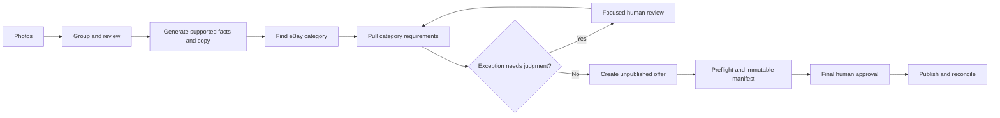

# Live Wire Listing Studio

An evidence-first workflow for turning mixed batches of antique and vintage-item photographs into reviewable, category-ready eBay listings.

Live Wire was designed around a practical seller problem: a listing is not just prose. It requires correct photo grouping, supported facts, marketplace-specific fields, shipping and policy decisions, and a final publication decision. The Studio automates repeatable work, preserves evidence, and surfaces only the decisions that need a person.

## What it does

1. Groups related photos into proposed items while keeping thumbnails visible.
2. Captures seller-confirmed facts separately from generated copy.
3. Generates structured titles, descriptions, and item specifics.
4. Resolves an eBay leaf category, then pulls allowed conditions and required specifics.
5. Creates an unpublished offer, validates its remote state, and prepares an immutable approval manifest.
6. Publishes only after a final human approval, then reconciles the live listing.



## Evidence, not adjectives

Three final, private Production reconciliation reports recorded **148 individual listing results**: 74, 16, and 58 respectively. Each report recorded unique offer and listing identities, zero final exceptions, and zero recorded manifest differences. The raw operational reports remain private; the public account is summarized in [Production Validation](docs/PRODUCTION_VALIDATION.md).

## Cost-aware AI design

Live Wire treats intelligence cost as a product constraint:

- Local code and eBay APIs handle deterministic work such as state, categories, policies, manifests, uploads, and reconciliation.
- Luna is the routine listing-generation route.
- Terra is an explicit enhanced-review exception for more complex image sets.
- Sol is reserved for engineering and unusual high-risk work, not normal listing generation.
- Cost Control v1 records model path, token usage, estimated cost, and saved-result reuse.
- OpenRouter is evaluated as an optional, consented first-pass provider; it is not a default Production route.

Read [Cost Control v1](docs/COST_CONTROL_V1.md) for the full decision record.

## Portfolio guide

- [Product case study](docs/PRODUCT_CASE_STUDY.md)
- [Portfolio talk track](docs/PORTFOLIO_TALK_TRACK.md)
- [Architecture](docs/ARCHITECTURE.md)
- [Production validation](docs/PRODUCTION_VALIDATION.md)
- [Security and human review](docs/SECURITY_AND_HUMAN_REVIEW.md)
- [Decision evidence](docs/DECISION_EVIDENCE.md)

## Technology

- TypeScript, React, and Next.js-compatible routing
- Vinext/Vite and Cloudflare Worker-compatible deployment
- Cloudflare D1 and R2 for durable state and images
- eBay OAuth, Account API, Inventory API, and Media API
- OpenAI Responses API for image-aware listing generation
- IndexedDB for device-local active-work continuity

## Safety and privacy

Credentials are hosted runtime values and are never committed. Raw batch photos, rescue reports, tokens, and seller-specific operational artifacts are excluded from this public repository. Live publication requires a prepared offer, remote preflight, immutable manifest, and exact final approval.

See [Security and Human Review](docs/SECURITY_AND_HUMAN_REVIEW.md) for boundaries and limitations.

## Local development

Requirements: Node.js 22.13+ and npm.

```bash
npm install
npm run dev
npm test
```

The hosted integration expects environment variables for eBay and OpenAI credentials. Do not add values to source files, screenshots, issues, or commits.

## Status

This is an active private Production application and a public portfolio repository. It demonstrates a real workflow and reconciled production results; it is not presented as a multi-tenant commercial product or a guarantee that an AI can identify every collectible without seller review.

