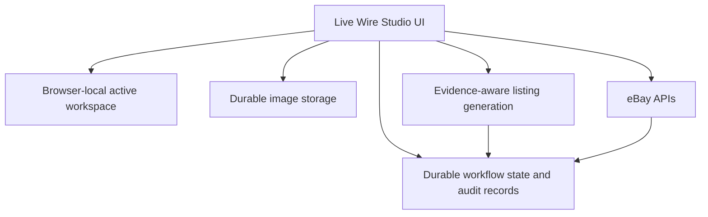
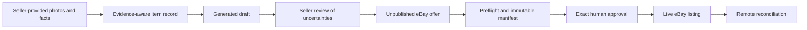

# Architecture

## Product architecture

## Trust boundaries

## State design

An item is not represented by a single generic status. The Studio tracks independent dimensions for content, evidence confidence, eBay synchronization, offer state, publication state, and operation state. That distinction is what allows it to show a useful next action and to recover safely after a partial failure.

## Why the architecture is API-first

The marketplace is the authoritative source for remote listing state. Browser controls are helpful for seller review, but the durable workflow is built around eBay APIs, idempotent operation records, read-back comparisons, immutable manifests, and reconciliation. This makes it possible to recover from token expiry, a lost local response, or a timeout without creating duplicate offers or silently changing a live listing.

## Commercialization boundary

The current application is a private owner-operated Production tool. A multi-user commercial version would need further work on account isolation, authorization, operational monitoring, provider configuration, support processes, and broader security review. The public repository documents the design and validated workflow; it does not claim those commercial controls are already complete.

