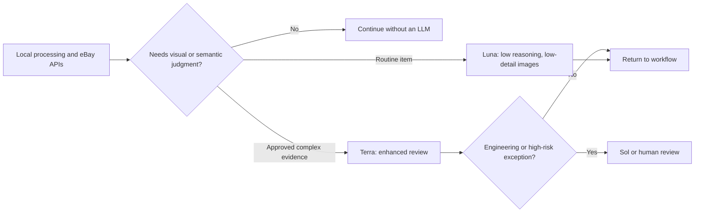

# Cost Control v1

## The constraint

Live Wire's value depends on throughput, but its unit economics cannot depend on sending every task to the most capable reasoning model. Photo cleanup, idempotency, category retrieval, policy application, manifest creation, offer read-back, and reconciliation are not creative-reasoning problems. Paying a reasoning model to do them would be wasteful and harder to verify.

## The routing policy

### Local and deterministic work

The system keeps these activities out of the model path wherever possible:

- image ordering, hashing, durable storage, and duplicate handling;
- workflow state, idempotency, manifests, and audit records;
- eBay category lookup, condition lookup, policies, location, and preflight;
- offer creation, remote read-back, publishing, and reconciliation.

### Model escalation

| Situation | Route | Why |
|---|---|---|
| One to four ordinary photos | Luna | Low-cost routine listing generation |
| More than four photos or explicitly approved deeper review | Terra | Higher-detail evidence inspection |
| Architecture, recovery, or an unusual high-risk issue | Sol or human review | Not routine listing work |

## What v1 implements

- A single routing function defining model, reasoning level, image detail, and escalation reason.
- Per-generation telemetry: selected model, image detail, reasoning level, response token counts, and estimated model cost.
- A fingerprint of unchanged inputs and a durable saved-result reuse path.
- A batch command-center summary showing generation count, reuse count, estimated spend, and model mix.
- Tests that verify routine-vs-enhanced routing, cost calculation, cache behavior, and preservation of publication safeguards.

## OpenRouter: evaluated, not assumed

OpenRouter is a potential first-pass provider for low-cost OCR, classification, or draft-only work. It is not the default Production route in Cost Control v1.

The decision is deliberate:

1. Third-party image processing requires explicit destination-specific consent.
2. A low-cost provider must meet evidence-quality and structured-output requirements on an evaluation set.
3. Privacy guardrails and endpoint availability are hard constraints; the project does not weaken them merely to access a free model.
4. A provider abstraction must preserve the same human-review and publication boundaries regardless of model.

The next experiment is a small, non-publishing benchmark: compare an approved OpenRouter route against Luna on representative items, record factual accuracy and exception rate, then adopt it only if it improves the quality-cost tradeoff.

## Success measures

For a measured production batch, the intended operating target is:

- at least 85% of routine listing-generation calls on the economy path;
- Terra use tied to a recorded exception or explicit enhanced-review approval;
- no routine Sol usage;
- no duplicate model calls for unchanged accepted work;
- model cost, exception rate, and timing visible after the batch.

These are operating targets, not yet claims of achieved commercial unit economics.

