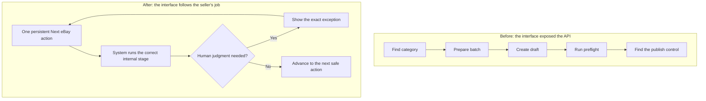

# Product Decisions, With Receipts

This page is the evidence layer for the Live Wire Listing Studio case study. It connects each product claim to something a reviewer can inspect.

## The workflow changed because of observed use

## Decision evidence map

| What a reviewer should conclude | Observable evidence | Where to inspect it |
|---|---|---|
| The workflow was designed around real seller judgment | Photographs remain attached to each proposed item; uncertain specifics require confirmation before offer creation | `app/page.tsx`, `tests/rendered-html.test.mjs` |
| The product responds to usability testing | Every listing now exposes a persistent next action rather than hiding later controls | `app/components/NextEbayAction.tsx`, `tests/next-action.test.mjs`, commit `25c1017` |
| Category selection drives a requirements exchange | Preparation resolves a leaf category, pulls allowed conditions and required aspects, and returns blockers | `app/api/ebay/prepare-item/route.ts`, `tests/prepare-item.test.mjs` |
| Marketplace writes are treated as durable operations | Draft creation reconciles by SKU and does not blindly retry ambiguous mutations | `app/api/ebay/draft-offer/route.ts`, `tests/remote-recovery.test.mjs` |
| Final approval applies to an exact listing | Price, photographs, policies, offer terms, and fees are frozen in an immutable manifest and checked again before publish | `lib/publication-manifest.ts`, `app/api/ebay/publish-offer/route.ts`, `tests/publication-manifest.test.mjs` |
| Failure testing shaped the architecture | Tests cover OAuth expiry, rate limiting, local timeout after remote success, concurrent sessions, migrations, malformed model output, inaccessible images, and encoding damage | `tests/` |
| The system moved beyond a mockup | The application connects to eBay Production, creates real unpublished offers, preflights them, and has completed a deliberately gated live publication | Commit history and private Production demonstration |
| Claims are kept honest | The throughput goal is labeled as a target until a timed canary measures it | `README.md`, `docs/PRODUCT_CASE_STUDY.md` |

## Product evolution visible in the commit history

| Stage | Representative commit | What changed |
|---|---|---|
| Evidence-first batch intake | `85c4c85` | Real local image review |
| Human review before prose | `a6d8f5f` | Evidence-labeled item specifics |
| Production marketplace path | `a794102` | Guarded eBay Production workflow |
| Remote validation | `f796353` | Comprehensive publish preflight |
| Durable operations | `82ffce2` | Item storage and eBay reconciliation |
| Exact publication approval | `b10e853` | Immutable manifests before publishing |
| Exception-driven preparation | `d603ba0` | Objective Prepare Batch and price approval |
| Cross-session resilience | `86fe720` | Durable workspace recovery |
| Usability correction | `25c1017` | One explicit next action per listing |

## Screenshot sequence for the public repository

Capture these after the next Production canary so the screenshots show real, coherent state:

1. Mixed photograph batch with proposed item boundaries and visible thumbnails.
2. Evidence review showing observed, inferred, and seller-confirmed facts.
3. **Next eBay action: Prepare for eBay**, including one genuine exception.
4. Prepared item with category-specific condition and item specifics.
5. Unpublished Production offer with photographs and preflight results.
6. Exact fee-and-manifest approval immediately before publication.
7. Reconciled live listing state—without exposing private credentials or customer data.

## Canary scorecard

The next run should publish its results here rather than relying on adjectives.

| Measure | Result |
|---|---|
| Items attempted | _Not measured yet_ |
| Items prepared without intervention | _Not measured yet_ |
| Exceptions requiring seller input | _Not measured yet_ |
| Median preparation time per item | _Not measured yet_ |
| Draft creation failures | _Not measured yet_ |
| Preflight failures | _Not measured yet_ |
| Duplicate offers or listings | _Not measured yet_ |
| Listings published as intended | _Not measured yet_ |
| Post-publication corrections required | _Not measured yet_ |

This scorecard is intentionally blank until observed Production results exist.
