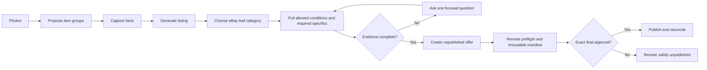

# From Listing Chore to Seller Operating System

## The problem

Listing antique, vintage, and one-of-a-kind inventory is a chain of connected judgments: identify the object, keep its photos together, describe condition accurately, establish a usable category, meet category requirements, select seller policies, and decide whether the resulting listing is truly ready for publication.

Most listing tools expose this as a long form. Live Wire Listing Studio was designed to feel more like supervising a capable operator: routine work advances automatically, evidence stays visible, and the seller is interrupted only when judgment is genuinely needed.

> Automation should remove repetition without hiding consequential decisions.

## Mark's role

Mark Beebe was the product owner, domain expert, workflow designer, and primary tester. He translated real selling practice into product requirements; set boundaries for condition, testing, pricing, shipping, and publication; tested the workflow against eBay Sandbox and Production; and used observed failures to redesign the experience.

OpenAI Codex served as an engineering collaborator. Mark retained ownership of scope, tradeoffs, acceptance standards, and every live-publication decision.

## The product model

The important design insight is the category push-pull loop. A category is not a dropdown selection made at the end. Selecting a supported leaf category pulls back the conditions and item specifics required by eBay; the Studio then maps supported evidence into those fields and returns only unresolved gaps.

## What changed during live testing

An earlier workflow was safe but disjointed: category selection, preparation, draft creation, preflight, and publication appeared as separate internal stages. Mark correctly identified that the interface was reflecting the API rather than the seller's job.

The redesign preserved the safety checks while adding one persistent **Next eBay action**. Instead of searching for the next hidden control, the seller sees the current state, the reason it is blocked, and the one safe action that advances it.

Other real integration lessons included leaf-category validation, category-specific condition rules, package requirements, OAuth expiry, timeout recovery, quantities, Best Offer, and the fact that a successful marketplace mutation can outlive a lost local response. Those lessons became reusable controls rather than isolated fixes.

## The intelligence-budget challenge

High-throughput listing automation also has an economic constraint: strong reasoning everywhere is expensive and unnecessary. Cost Control v1 formalized a routing policy:

- deterministic work stays local or uses eBay APIs;
- ordinary listing generation uses a low-cost Luna path;
- more complex evidence can explicitly escalate to Terra;
- Sol is reserved for engineering and genuinely hard exceptions;
- unchanged inputs reuse prior results rather than triggering another model call.

OpenRouter was explored as a constrained optional first-pass route. Its use remains opt-in and benchmark-led because privacy constraints and provider availability are product requirements, not inconveniences to bypass.

## Evidence of operation

Three private final-reconciliation reports recorded 148 individual Production listing results with unique remote identities and no final recorded exceptions or manifest differences. This public repository deliberately provides the aggregate outcome rather than source photos, seller records, offer IDs, or authentication artifacts.

The production system is intentionally gated. A batch result is not considered successful merely because a button was clicked: it is reconciled against remote eBay state.

## What this demonstrates

- Turning tacit operational knowledge into an explicit product workflow.
- Designing AI automation around exceptions and accountable human decisions.
- Treating marketplace writes as durable, reconcilable operations.
- Using live failures to improve UX, architecture, and safety controls.
- Balancing quality, throughput, privacy, and unit economics.
- Directing AI-assisted engineering with concrete acceptance criteria and iterative testing.

For inspection paths, see [Decision Evidence](DECISION_EVIDENCE.md). For a concise interview version, see [Portfolio Talk Track](PORTFOLIO_TALK_TRACK.md).

