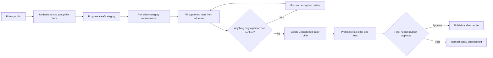

# From Listing Chore to Seller Operating System

## How I designed Live Wire Listing Studio

I built Live Wire Listing Studio around a problem I know firsthand: listing antique, vintage, and one-of-a-kind inventory is not one task. It is a chain of judgments—grouping photographs, identifying the object, choosing the right marketplace category, satisfying category-specific requirements, writing accurate copy, setting shipping and pricing, and deciding when the listing is safe to publish.

Most tools make that chain feel like a long form. My goal is different: make high-volume listing feel like supervising a capable operator. The system should complete routine work automatically, preserve the evidence behind its decisions, and bring me in only when judgment is genuinely required.

> **My product thesis:** Automation should remove repetition without hiding consequential decisions.

## My role

I am the product owner, domain expert, workflow designer, and primary tester. I defined what trustworthy listing copy looks like, supplied the operational rules learned from real selling, established the human-in-the-loop boundaries, tested the system against eBay Sandbox and Production, and used failures from live trials to reshape the product.

I worked with OpenAI Codex as my engineering collaborator: I set the product direction and acceptance criteria; Codex helped translate those decisions into architecture, interface behavior, tests, and deployment.

## The workflow I designed

The important part is the push-pull loop in the middle. Category selection is not an isolated dropdown. Once the system establishes a leaf category, it must pull the allowed conditions and required item specifics, map photo-supported evidence into those fields, identify gaps, and push a complete offer back to eBay.

## A product decision that changed the interface

An early build was technically safe but operationally disjointed. It exposed separate controls for category matching, preparation, draft creation, preflight, and publishing. Each control appeared only after the previous internal stage existed. The result protected against accidental publication—but made the seller hunt for the next action.

I challenged that design after using it. The answer was not to remove the safety gates. It was to turn the internal stages into one visible orchestration:

1. **Prepare for eBay** chooses or validates the category and pulls its requirements.
2. The system fills what the evidence supports and returns only exceptions.
3. **Create unpublished eBay draft** pushes the prepared item safely.
4. **Run final preflight** compares the real remote offer with the intended listing.
5. **Review fees and publish live** appears only when the exact offer is ready.

Every listing now has a persistent **Next eBay action** panel explaining its current stage, what remains, and the one correct action to take.

## Trust and safety are product features

The Studio separates independent states instead of reducing an item to a vague green check:

- content readiness;
- evidence confidence;
- remote synchronization;
- offer readiness;
- publication state; and
- operation/retry state.

Additional safeguards include immutable publication manifests, price approval, category and condition validation, required-specific checks, publicly retrievable image validation, duplicate-operation prevention, timeout reconciliation, owner-scoped durable storage, and a final review of the exact title, SKU, price, Best Offer setting, photographs, and eBay fees.

## What live testing taught me

Real marketplace integration exposed issues that mockups do not:

- a category can be valid but not be a leaf category;
- an item condition can be invalid for the selected category;
- package dimensions and weight can block publication;
- a successful remote mutation can outlive a local timeout;
- an enabled preference such as Best Offer is not the same as publish approval;
- a safe workflow can still fail if the user cannot see what to do next; and
- a deployment can succeed while authenticated end-to-end behavior remains unverified.

Those discoveries produced a stronger system, not a collection of one-off patches. The current architecture treats marketplace calls as durable, reconcilable operations and treats usability failures as workflow failures.

## What I demonstrated

- Translating deep domain knowledge into a concrete product strategy
- Designing automation around exceptions instead of repetitive data entry
- Balancing speed, evidence, marketplace rules, and human accountability
- Testing a real OAuth and eBay Production integration—not only a prototype
- Recognizing when technically correct software still delivers the wrong experience
- Directing iterative engineering work through observed failures and acceptance criteria
- Building toward a measurable target: preparing 40–50 listings in a short supervised batch session without sacrificing listing quality

## How I lead collaborative product work

The way I worked on this project is part of the outcome. I gave my engineering collaborator meaningful autonomy while remaining accountable for product direction. I asked for expert pushback, invited UI/UX judgment, and then tested proposed solutions against the actual seller workflow instead of deferring to implementation details.

Several behaviors were especially important:

- **Operational specificity:** I turned tacit seller knowledge into clear rules about descriptions, condition, testing, photographs, shipping, pricing, offers, and revisions.
- **Constructive challenge:** I questioned uniform prices, package assumptions, category behavior, hidden publish gates, and whether batch features actually reduced work.
- **Customer empathy:** I treated expectation setting and reputation as product requirements, not optional copywriting polish.
- **Systems thinking:** I recognized that category selection initiates a pull of allowed conditions and required specifics, followed by a push of completed data—not a standalone dropdown choice.
- **Learning agility:** I worked through unfamiliar OAuth, policy, taxonomy, inventory, and Production constraints without losing sight of the business objective.
- **Quality under ambition:** I pushed for dramatic throughput improvement while explicitly refusing to trade away professionalism, accuracy, or build quality.
- **Candid iteration:** When the experience became confusing, I said so plainly and helped articulate a better model instead of accepting a technically correct workflow.

For résumé bullets, interview answers, and a concise client-facing explanation, see the [Portfolio Talk Track](PORTFOLIO_TALK_TRACK.md).
## Current status

The private application supports photo grouping, evidence-aware listing generation, eBay Production connection, account policy selection, durable workspace recovery, category-aware preparation, unpublished offer creation, preflight validation, deliberately gated live publication, and remote reconciliation. The production build is protected by automated tests covering migrations, concurrency, retries, OAuth expiry, rate limiting, malformed model output, inaccessible images, manifest drift, and interface encoding.

The next milestone is a measured multi-item production canary: time the batch, record exception rates, review listing accuracy, and use those results to simplify the workflow further.
